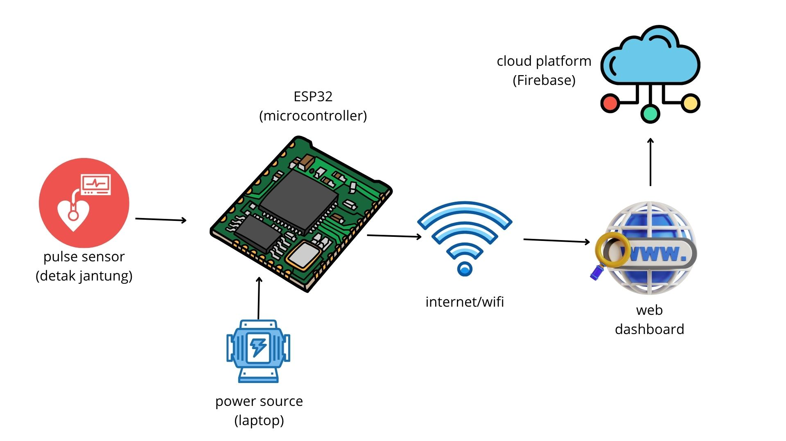

# Diagram Blok Sistem

# 💓 IoT-Based Digital Health Monitoring System (Kelompok 6)

Sistem ini menggunakan **pulse sensor (sensor detak jantung)** yang terhubung ke modul **ESP32** untuk memantau kondisi detak jantung pasien secara **real-time**.  
Data BPM (_beats per minute_) dikirimkan melalui koneksi **Wi-Fi** ke platform cloud seperti **Firebase**, lalu ditampilkan dalam bentuk **visualisasi melalui dashboard web**.  
Sistem ini juga secara otomatis memberikan status **"Normal"** atau **"Warning"** berdasarkan nilai BPM yang terbaca.

---

## 🎯 Tujuan Proyek

- Memonitor detak jantung pasien secara digital dan real-time.  
- Menentukan status detak jantung (Normal atau Warning) secara otomatis.  
- Mengirimkan data BPM ke platform cloud untuk visualisasi.  
- Menyediakan tampilan web interaktif untuk memudahkan pemantauan pasien.  
- Membantu tenaga medis atau keluarga dalam mendeteksi kondisi tidak normal secara cepat.

---

## 🧠 Skema Sistem

### 🔌 Input:
- Pulse Sensor sebagai input utama untuk membaca sinyal detak jantung pasien.

### ⚙️ Proses:
- ESP32 membaca sinyal analog dari pulse sensor.  
- Sistem menghitung jumlah detak per menit (BPM).  
- Logika program menentukan status BPM:
  - **Normal** jika BPM antara 60–100  
  - **Warning** jika BPM < 60 atau > 100  
- Data BPM dan status dikirim ke Firebase melalui koneksi Wi-Fi.

### 📊 Output:
- Tampilan nilai BPM secara real-time pada halaman web.  
- Notifikasi status kesehatan (Normal / Warning).  
- Grafik riwayat detak jantung berbasis waktu menggunakan **Chart.js**.

---

## 🔧 Komponen Utama

- **ESP32** (mikrokontroler dengan koneksi Wi-Fi)  
- **Pulse Sensor** (sensor detak jantung analog)  
- **Power Source** (laptop, power bank, atau adaptor)  
- **Firebase** (platform cloud untuk penyimpanan data)  
- **Dashboard Web** (HTML + CSS + JavaScript + Chart.js)

---

## 🌍 Keterkaitan dengan SDG

Proyek ini mendukung **Sustainable Development Goal (SDG) 3: Good Health and Well-Being** dengan menyediakan sistem monitoring detak jantung yang:

- Mudah digunakan  
- Terjangkau  
- Real-time  
- Cocok untuk digunakan di rumah, klinik kecil, atau layanan kesehatan darurat

---

## 🧪 Cara Penggunaan

1. Hubungkan **Pulse Sensor** ke pin analog pada **ESP32**.  
2. Sambungkan **ESP32** ke sumber daya listrik (laptop atau power bank).  
3. Hubungkan ESP32 ke Wi-Fi lokal.  
4. Integrasikan ESP32 dengan **Firebase** untuk penyimpanan data.  
5. Akses dashboard web melalui browser.  
6. Tekan tombol **"Mulai Mengukur"** untuk memulai proses selama 15 detik.  
7. Amati hasil BPM dan status kesehatan yang muncul di layar.  
8. Gunakan tombol **"Lihat Riwayat"** untuk melihat grafik detak jantung sebelumnya.

