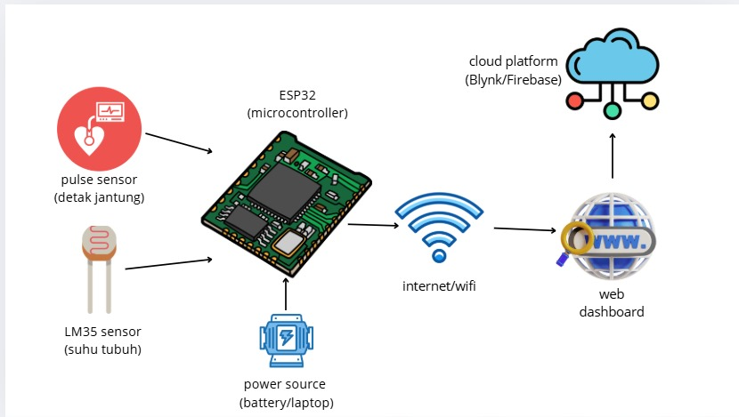

# Diagram Blok Sistem

# IoT-Based Digital Health Monitoring System (Kelompok 6)

Sistem ini menggunakan sensor detak jantung dan sensor suhu tubuh yang terhubung dengan modul ESP32 untuk memantau kondisi kesehatan pasien secara digital di lokasi yang sama. Data dikirim melalui koneksi Wi-Fi ke platform cloud seperti Blynk atau Firebase, lalu ditampilkan secara real-time melalui dashboard berbasis aplikasi atau web.

## Tujuan Proyek
- Memonitor detak jantung dan suhu tubuh pasien secara real-time di tempat.
- Mengirimkan data sensor ke platform cloud melalui Wi-Fi lokal.
- Menyediakan visualisasi digital data kesehatan menggunakan aplikasi atau dashboard.
- Mendukung sistem pemantauan kesehatan berbasis teknologi di lingkungan lokal.

## Skema Sistem

### Input:
- Pulse Sensor (sensor detak jantung)
- LM35 Sensor (sensor suhu tubuh)

### Proses:
- ESP32 membaca data dari sensor melalui pin analog.
- Data dikirim ke cloud melalui Wi-Fi lokal.

### Output:
- Data ditampilkan secara real-time di Blynk App atau Dashboard Web Firebase.

## Komponen Utama
- ESP32
- Pulse Sensor
- LM35 Sensor
- Power Source
- Cloud Platform: Blynk / Firebase

## Keterkaitan dengan SDG
Mendukung **SDG 3: Good Health and Well-Being** dengan menyediakan sistem pemantauan kesehatan sederhana namun efektif, yang dapat digunakan secara langsung di lokasi pasien.

## Cara Penggunaan
1. Hubungkan Pulse Sensor dan LM35 ke ESP32 sesuai skema kabel.
2. Sambungkan ESP32 ke laptop atau power bank.
3. Hubungkan ESP32 ke Wi-Fi lokal.
4. Integrasikan ESP32 dengan platform Blynk atau Firebase.
5. Pantau data secara real-time melalui aplikasi atau web dashboard.

